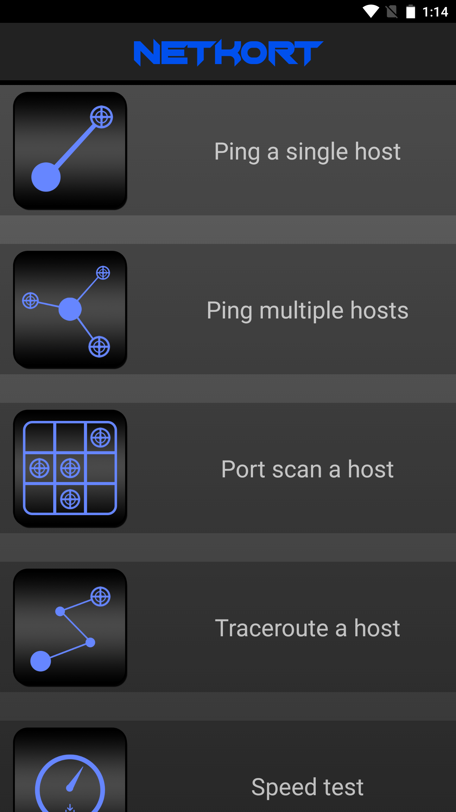

# Netkort
### _Observe the network_

Netkort is a set of simple network tools for Android.
Each tool and utility has basic functionality and is easy to understand.

## List of implemented utilities and features

- Pinging a single host
- Pinging multiple hosts
- Port scanning a host (simple TCP connection)
- Tracerouting a host
- Testing download rate
- Network sweeping
- Saving the logs of utilities

## Screenshots

## Contact
- [Mahdi-R](https://github.com/1MahdiR) : a.m.rasouli.n@gmail.com
- [Linkedin](https://www.linkedin.com/in/amir-mahdi-rasouli-39566a143/)

## Contributing

Contributions are what make the open source community such an amazing place to learn, inspire, and create. Any contributions you make are **greatly appreciated**.

1. Fork the Project
2. Create your Feature Branch (`git checkout -b feature/AmazingFeature`)
3. Commit your Changes (`git commit -m 'Add some AmazingFeature'`)
4. Push to the Branch (`git push origin feature/AmazingFeature`)
5. Open a Pull Request

Project Link: [https://github.com/1MahdiR/Djungool](https://github.com/1MahdiR/Djungool)

You can also create an issue if you have any ideas or suggestions about how to make Netkort better.

## License

[GPL-3.0 License](https://github.com/1MahdiR/Netkort/blob/master/LICENSE)
